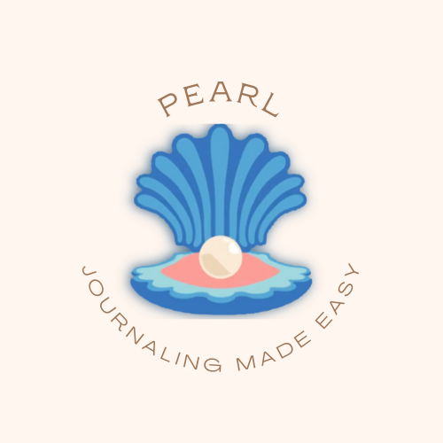
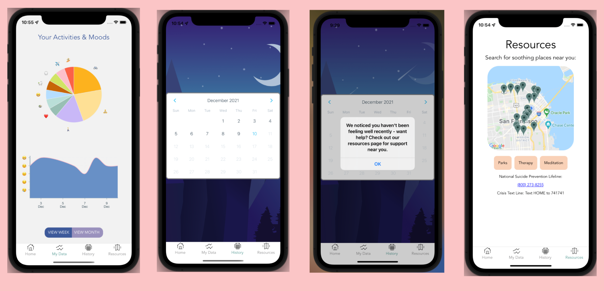

<p align="center">
 
</p>

<h2 align="center">Pearl</h2>

## About

Pearl is a journaling app - and a necessary one. Mental health issues have become more and more common over the past couple years - many Americans now report feelings of depression and anxiety. Journaling has been shown to combat those feelings.
But it’s not always easy to find time to journal!
Have you broken some habits due to covid, are curious about the trends of what you do and how you feel, or just want to start journaling?
Well, Pearl makes journaling easy; just push a few buttons to enter your activities and moods for the day. In exchange, you’ll get a pearl of wisdom: visual insights on your emotions over time.

<br/>
<p align="center"></p>
<br/>
<p align="center"></p>

<br/>
## Docs

Notion Documentation:
https://sky-puppet-bcc.notion.site/Capstone-27b4a5ca906f40d1b368460a57ad8124

## Getting Started

1. Clone the repository:

```
git clone git@github.com:Nacho-Wifi/pearl.git
cd pearl
```

2. Create a `.env` file in the root to store your API keys:

3. Install dependencies:
   ```
   npm install
   ```
4. Start expo to run simulator:
   ```
   expo start
   ```

## Built Using

<a href="https://developer.mozilla.org/en-US/docs/Web/JavaScript" title="JavaScript"></a> Javascript  
<a href="https://nodejs.org/" title="Node.js"></a> Node.js  
<a href="https://www.firebase.com/" title="Firebase"></a> Firebase  
<a href="https://expo.dev/" style="text-decoration:none" title="Expo">:iphone:</a> Expo  
<a href="https://reactnative.dev/" title="ReactNative"></a> React Native  
<a href="https://formidable.com/open-source/victory/docs/native/" style="text-decoration:none" title="VictoryNative">:chart_with_upwards_trend:</a> Victory Native  
<a href="https://www.tensorflow.org/js" style="text-decoration:none" title="Tensorflow">:brain:</a> Tensorflow  
<a href="https://babeljs.io/" title="Babel"></a> Babel  
<a href="https://www.npmjs.com/" title="npm"></a> NPM

## Contributors

Caroline Spiezio

#### :octocat: <a href="https://github.com/spieziocaroline">GitHub</a>

#### :link: <a href="https://www.linkedin.com/in/spieziocaroline/">LinkedIn</a>

Emma Strickland

#### :octocat: <a href="https://github.com/emma-strickland">GitHub</a>

#### :link: <a href="https://www.linkedin.com/in/emmalstrickland/">LinkedIn</a>

Margaret Farmer

#### :octocat: <a href="https://github.com/m-farmer">GitHub</a>

#### :link: <a href="https://www.linkedin.com/in/margaret-farmer/">LinkedIn</a>

Kah Yan Lee

#### :octocat: <a href="https://github.com/kahyanlee6">GitHub</a>

#### :link: <a href="https://www.linkedin.com/in/kahyan-lee/">LinkedIn</a>
